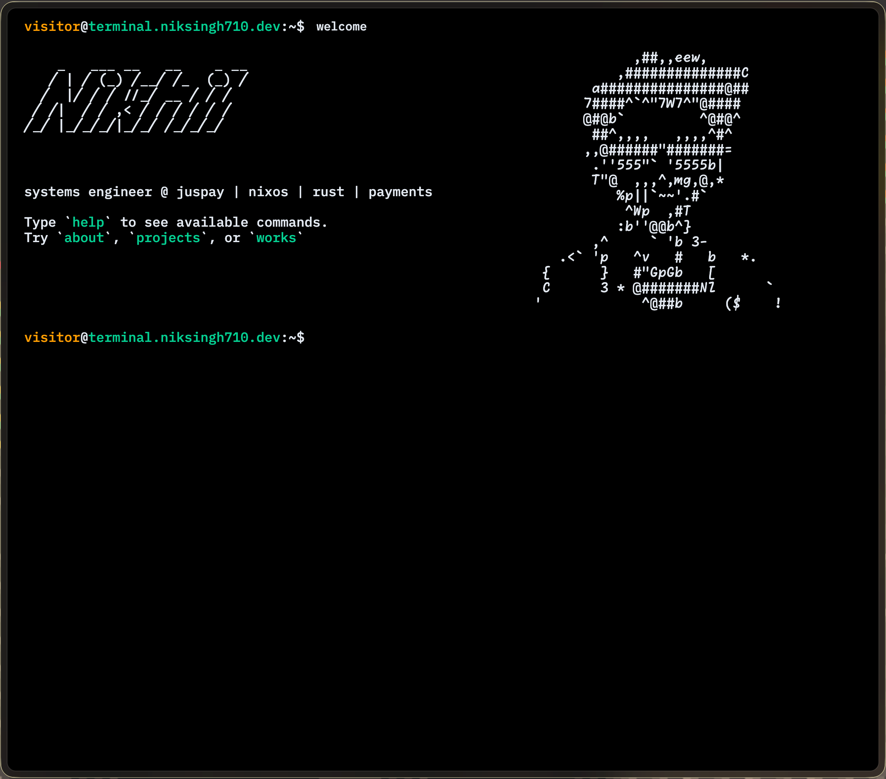

# Terminal Portfolio

A terminal-themed portfolio website built with React, TypeScript, and Vite.

**[Live Demo](https://niksingh710.vercel.app)**



## Features

- **Interactive Terminal Interface** - Navigate like a real terminal
- **File Commands** - `ls`, `cat`, `get` to browse content
- **Theme System** - 8 themes: dark, light, blue-matrix, espresso, green-goblin, coffee, gruvbox, ubuntu
- **Project Showcase** - Featured projects with metrics
- **Work Experience** - Career history with achievements
- **Resume PDF** - Download CV with `get cv`

## Commands

| Command | Description |
|---------|-------------|
| `help` | Show all available commands |
| `ls` | List files (skills.txt, philosophy.txt, experience.txt, contact.txt) |
| `cat <file>` | Display file contents |
| `get cv` | Download resume PDF |
| `themes` | List available themes |
| `set <theme>` | Change theme |
| `projects` | View featured projects |
| `works` | View work experience |
| `about` | About me |
| `socials` | Social media links |

## Development

### Prerequisites

- Node.js (managed via Nix)
- npm

### Setup with Nix

This project uses Nix for reproducible development environments:

```bash
# Enter development shell
nix develop

# Or use direnv
 direnv allow
```

### Available Scripts

```bash
npm run dev        # Start development server
npm run build      # Build for production
npm run preview    # Preview production build
npm test           # Run tests
```

## Tech Stack

- **Framework**: React 18 + TypeScript
- **Build Tool**: Vite 8
- **Styling**: styled-components
- **Testing**: Vitest
- **PWA**: vite-plugin-pwa
- **Dev Environment**: Nix Flakes

## Credits

Original template by [Satnaing](https://github.com/satnaing/terminal-portfolio)